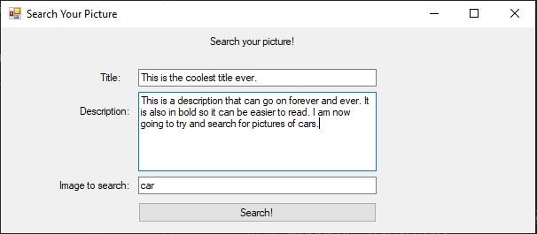
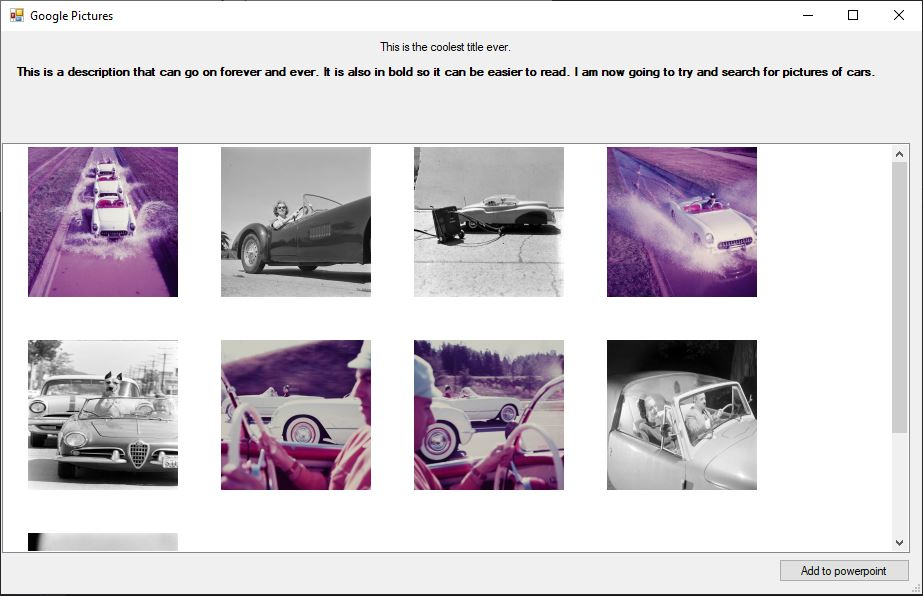

# SearchImg
SearchImg is a project that utilizes the GoogleApi to search for images. When you run the code, you will be prompted with a title, description, and image to search textboxes. The title and description text box will be inserted into the title/description section on powerpoint and second form, and the images to search textbox is what is being searched using the API. 

It will then display 9 images depending on what you entered. It will also display the title that you typed in the first form, and the description but in bold. You can click multiple images to be added to the powerpoint. You can click on multiple images by holding ctrl and then clicking. You will then click "add to powerpoint" and it will add them to powerpoint.

