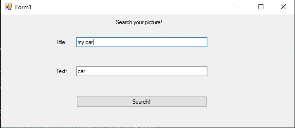

# SearchImg
SearchImg is a project that utilizes the GoogleApi to search for images. When you run the code, you will be prompted with a title and text textboxes. The title text box will be inserted into the title section on powerpoint, and the text textbox is what is being searched using the API. 

It will then display 9 images depending on what you entered. You can click multiple images to be added to the powerpoint. You can click on multiple images by holding ctrl and then clicking. You will then click "add to powerpoint" and it will add them to powerpoint.

